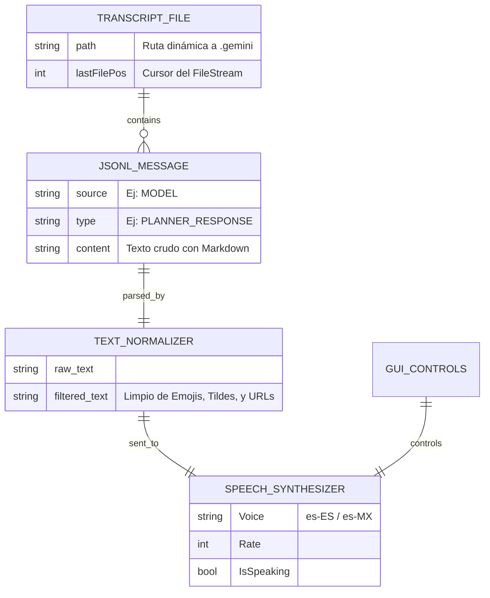
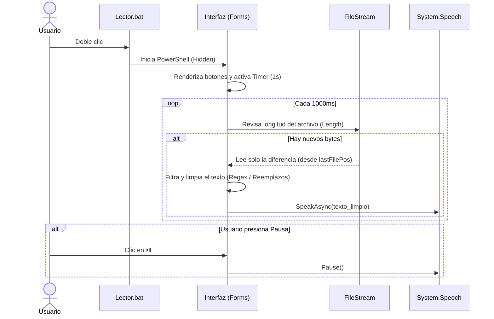

# 🏗️ Antigravity Voice Reader - Arquitectura del Sistema (Project.md)

Este documento centraliza el diseño arquitectónico, flujos de datos y estrategias técnicas de **Antigravity Voice Reader**, herramienta auxiliar para sintetizar las respuestas del asistente, estructurado bajo la visión de la habilidad `el-arquitecto`.

---

## 1. Justificación del Stack Tecnológico

| Capa | Tecnología | Justificación de Arquitectura |
| :--- | :--- | :--- |
| **Lenguaje Core** | **PowerShell 5.1+** | Nativo de Windows. Permite interactuar con los motores de texto a voz y las librerías gráficas (`System.Windows.Forms`) sin requerir instalación de entornos adicionales como Node.js o Python. |
| **Motor TTS** | **System.Speech.Synthesis** | API nativa de .NET integrada en Windows. No requiere internet, no consume cuotas de API de terceros, garantiza privacidad total (procesamiento offline) y cero latencia de red. |
| **Interfaz UI** | **Windows Forms (.NET)** | Ligero y de disponibilidad inmediata. Permite crear mini-reproductores "flotantes" (TopMost) y asíncronos que no consumen casi memoria RAM. |
| **Parser de Datos** | **ConvertFrom-Json** | Motor nativo capaz de leer archivos `.jsonl` sin depender de librerías externas. |

---

## 2. Estructura de Directorios

La estructura sigue principios minimalistas y de responsabilidad única:

```text
antigravity-voice-reader/
├── 📄 Lector.bat           # 🚀 Entry-point amigable para el usuario final. Lanza el proceso oculto.
├── 📄 reader_gui.ps1       # 💻 Código principal: UI, Lógica de Stream, Regex y Motor TTS.
├── 📄 README.md            # 📖 Documentación técnica y manual de instalación rápido.
└── 📄 Project.md           # 🏗️ Arquitectura y flujos técnicos (Este archivo).
```

---

## 3. Modelo de Datos e Integridad (ERD)

Aunque no tenemos una base de datos tradicional, el flujo de datos depende fuertemente de la lectura del registro (Transcript). Este es el modelo conceptual de las entidades que manipulamos en memoria:



---

## 4. Flujos de Usuario e Integración (Secuencia)

Diagrama del flujo crítico asíncrono para el **Monitoreo Cero-Bloqueos (0-Block UI)**:



---

## 5. Cumplimiento Normativo y Seguridad por Diseño (Compliance)

1.  **Privacidad de Datos (DSGVO / GDPR)**:
    *   **Procesamiento Offline**: Todo el texto de las conversaciones procesado por el lector nunca abandona la máquina del usuario. No se envía telemetría, ni logs a servidores de terceros.
    *   **Lectura Efímera**: Los textos se mantienen en memoria volátil de PowerShell el tiempo estrictamente necesario para su lectura y se descartan inmediatamente tras el evento de finalización del sintetizador.
2.  **Seguridad de Ejecución**:
    *   Uso de `ExecutionPolicy Bypass` explícito en `Lector.bat` para asegurar que el script corre de manera confiable sin alterar permanentemente las políticas globales restrictivas (Restricted) del SO Windows.
3.  **Aislamiento de Entorno**:
    *   La herramienta no requiere claves, tokens ni acceso a internet, limitando a cero el riesgo de exposición de credenciales o accesos maliciosos por red.

---

## 6. Diseño UI / UX y Adaptabilidad

*   **Foco en Accesibilidad**: El mini-reproductor no intenta reemplazar el editor de código, sino ser una herramienta periférica.
*   **Modo TopMost (Flotante)**: Configurado para permanecer siempre por encima del IDE (Visual Studio Code o Cursor), garantizando que los controles de audio estén a un clic de distancia sin necesidad de cambiar el foco de la ventana de código.
*   **Minimalismo Visual**: Controles limitados a las 3 acciones vitales (Play/Pause, Stop, Replay) usando iconografía universal.

---

## 7. Gestión de Riesgos y Mitigaciones

1.  **Riesgo**: Bloqueo del Hilo Principal de UI (UI Freeze).
    *   *Mitigación*: En lugar de usar `Get-Content` o leer el archivo repetidamente, se implementó un `StreamReader` de bajo nivel que almacena la posición del cursor (`Stream.Position`). Esto lee operaciones de bytes en lugar de cargar en RAM archivos grandes de log (O(1) lectura en vez de O(N)).
2.  **Riesgo**: Pronunciación Robótica e Incomprensible de Vocales Acentuadas por Motor TTS incompatible.
    *   *Mitigación*: Implementación de un motor de reemplazo agnóstico de codificación (basado en bytes hexadecimales ASCII) que convierte tildes y eñes a caracteres crudos anglosajones y fuerza dinámicamente la búsqueda de una cultura regional con prefijo `es-*` en el host.
3.  **Riesgo**: Lectura interminable de bloques de código.
    *   *Mitigación*: Algoritmo de expresiones regulares (Regex) diseñado para omitir silenciosamente el interior de todo elemento envuelto en ``` antes de pasarlo al motor TTS.

<br>

## 8. Clonación

Para clonar este repositorio y empezar a trabajar en local, ejecuta el siguiente comando en tu terminal:

```bash
git clone https://github.com/dwn10/AntigravityVoiceReader.git
cd AntigravityVoiceReader
```

## 9. Contribución

¡Las contribuciones son siempre bienvenidas! Si deseas mejorar el proyecto, sigue estos pasos:
1. Haz un **Fork** del proyecto.
2. Crea tu rama de características (`git checkout -b feature/MejoraIncreible`).
3. Realiza tus cambios y haz commit de ellos (`git commit -m 'Añadir alguna MejoraIncreible'`).
4. Haz push a la rama (`git push origin feature/MejoraIncreible`).
5. Abre un **Pull Request**.

## 10. Licencia

Este proyecto está distribuido bajo la licencia **MIT**. Para más información, consulta el archivo [LICENSE](./LICENSE) incluido en este repositorio. La licencia permite uso comercial, modificación, distribución y uso privado.

<br>
<p align="center">
  <a href="./README.md"></a>
  <a href="./LICENSE"></a>
</p>

---
<br>
<p align="center">
  <small>All rights reserved © 2026 | <a href="https://github.com/dwn10">Darwin Paz</a></small>
</p>
